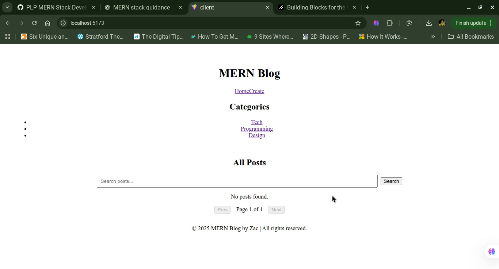
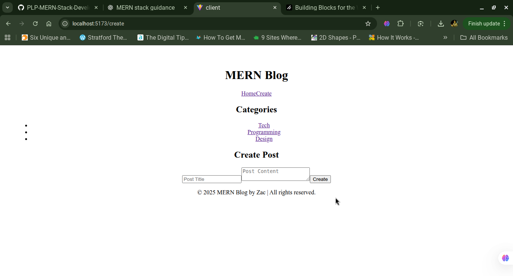

# 📰 MERN Stack Blog Application

## 🔄 Week 4: Deep Dive into MERN Stack Integration

### 🚀 Objective
Build a full-stack MERN (MongoDB, Express.js, React.js, Node.js) application that demonstrates seamless integration between front-end and back-end components, including database operations, API communication, and state management.

---

## 📖 Project Overview
This project is a **MERN stack blog application** that enables users to:
- Create, view, edit, and delete blog posts
- Categorize posts
- Upload featured images
- Manage posts and categories using a clean and responsive React interface
- Perform CRUD operations through a RESTful API built with Node.js and Express.js
- Store data in MongoDB using Mongoose

---

## 🏗️ Project Structure
```
mern-blog/
│
├── client/                # React front-end (Vite + Tailwind CSS)
│   ├── src/
│   │   ├── components/    # Reusable React components
│   │   ├── pages/         # Page views (Home, Post, Edit, etc.)
│   │   ├── hooks/         # Custom React hooks
│   │   ├── services/      # API service files
│   │   ├── App.jsx        # Main React app
│   │   └── main.jsx       # Entry point
│   └── vite.config.js
│
├── server/                # Express + Node.js back-end
│   ├── models/            # Mongoose models (Post, Category)
│   ├── routes/            # API route definitions
│   ├── middleware/        # Validation & error handling
│   ├── server.js          # Entry point for server
│   └── .env.example       # Environment configuration
│
└── README.md
```

---

## ⚙️ Setup Instructions

### 1️⃣ Prerequisites
- Node.js v18+
- MongoDB (local or cloud instance)
- npm or yarn

### 2️⃣ Installation
Clone the repository:
```bash
git clone https://github.com/PLP-MERN-Stack-Development/mern-stack-integration-McAyany.git
cd mern-blog
```

Install dependencies:
```bash
# Backend
cd server
npm install

# Frontend
cd ../client
npm install
```

---

### 3️⃣ Environment Variables

Create a `.env` file inside both **server** and **client** directories.

#### Server `.env.example`
```
PORT=5000
MONGODB_URI=mongodb://localhost:27017/mern_blog
JWT_SECRET=your_jwt_secret
```

#### Client `.env.example`
```
VITE_API_URL=http://localhost:5000/api
```

---

### 4️⃣ Run Development Servers

```bash
# Start backend
cd server
npm run dev

# Start frontend
cd ../client
npm run dev
```

Your app will be running at:
- Frontend → http://localhost:5173
- Backend → http://localhost:5000

---

## 📡 API Documentation

### Posts API
| Method | Endpoint | Description |
|--------|-----------|-------------|
| GET | `/api/posts` | Get all blog posts |
| GET | `/api/posts/:id` | Get single post |
| POST | `/api/posts` | Create a new post |
| PUT | `/api/posts/:id` | Update a post |
| DELETE | `/api/posts/:id` | Delete a post |

### Categories API
| Method | Endpoint | Description |
|--------|-----------|-------------|
| GET | `/api/categories` | Get all categories |
| POST | `/api/categories` | Create a new category |

---

## 🧱 Models

### Post Model
```js
{
  title: String,
  content: String,
  category: { type: mongoose.Schema.Types.ObjectId, ref: "Category" },
  image: String,
  createdAt: { type: Date, default: Date.now }
}
```

### Category Model
```js
{
  name: String
}
```

---

## 🎨 Frontend Highlights

- Built with **React + Vite**
- Styled using **Tailwind CSS**
- Routing via **React Router DOM**
- Data fetching with **custom hooks**
- State managed via **React Context**
- Responsive layout with reusable components

---

## ⚡ Features Implemented
✅ CRUD for Posts & Categories  
✅ RESTful API with Mongoose models  
✅ Input validation using express-validator  
✅ Error handling middleware  
✅ Tailwind-based responsive UI  
✅ Optimistic UI updates  
✅ Pagination, search & filtering  
✅ Image uploads for posts  
✅ JWT authentication with protected routes  

---

## 🧪 Expected Outcome
By completing this project, we have:
- A fully functional MERN stack blog
- A structured front-end & back-end integration
- Implementation of RESTful APIs
- Clean, reusable code and components
- A responsive, modern interface

---

## 📸 Screenshots

### 🏠 Home Page


### ✍️ Create Post Page


---

## ✅ Submission Checklist
- [x] Complete client and server code
- [x] `.env.example` files included
- [x] Comprehensive README
- [x] Screenshots added
- [x] Code pushed to GitHub Classroom repository

---

## 👨‍💻 Author
**Ayany Obala**  
MERN Stack Developer | Student Developer Program  
📧 ayanyobala@gmail.com  
🌐 [GitHub]https://github.com/McAyany

---

## 🪪 License
This project is licensed under the MIT License.
